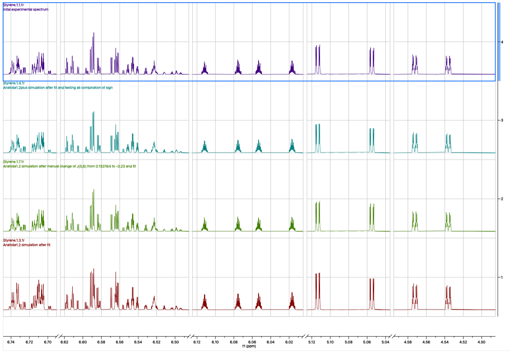
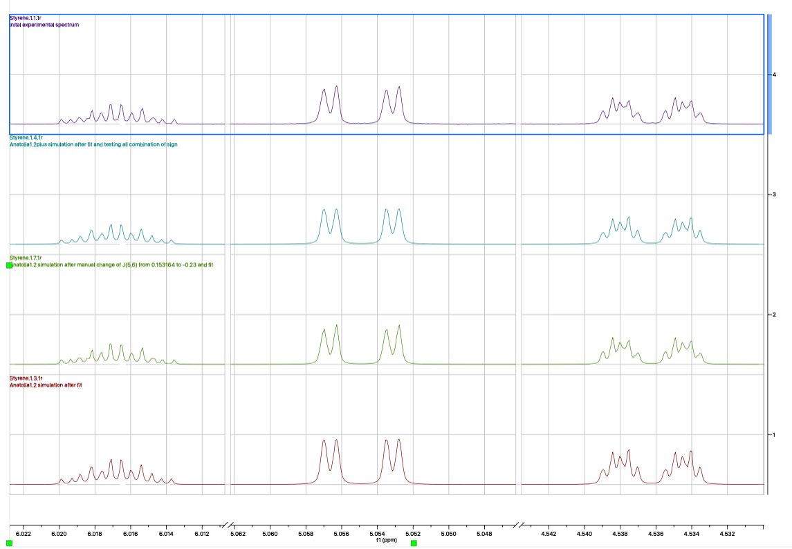
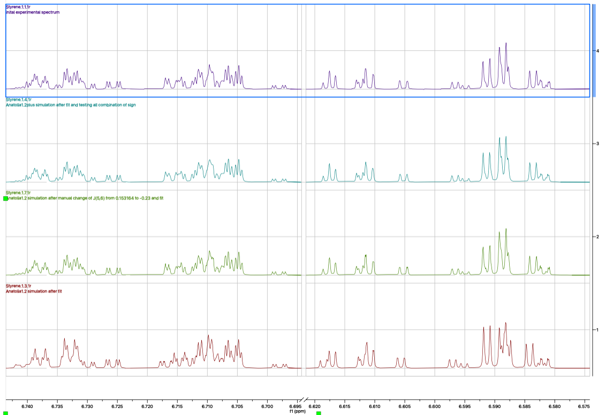

The sepctrum 4 (best match after changing signs) is better than 3 (result of the main optimization).

The experimental is visually identical to the experimental spectrum.

##  Full Spectra

##  Zoom of the aromatic region

## Zoom of the vinylic region
From the dd, d and d of the vynilic region, this images shows only the details of one line of the main dd, d, d. 

